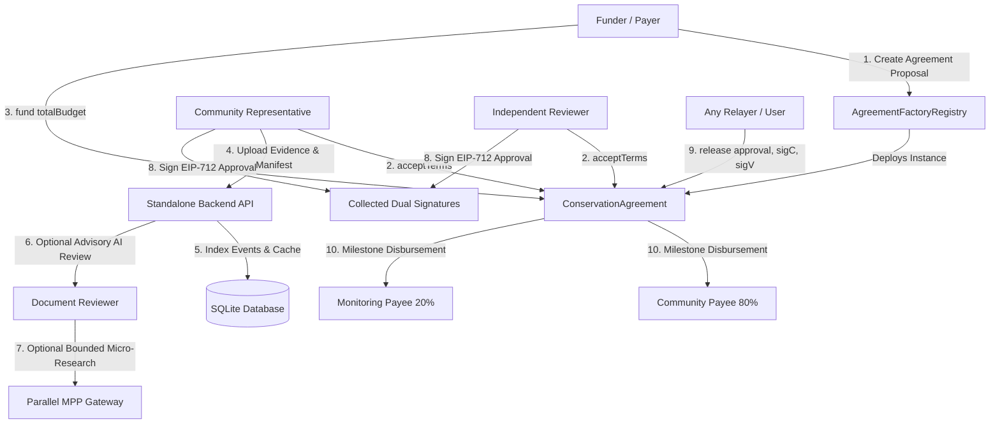

# MINGA Nature — Architecture Specification

## 1. High-Level Flow

## 2. Sources of Truth

| Entity | Primary Authority | Fallback / Role |
|---|---|---|
| **Terms, Budgets & Allocations** | HSK Chain (`termsHash`) | Immutable contract state |
| **Custody & Escrow** | `ConservationAgreement.sol` | Locked ERC20 (`MockUSD`) |
| **Milestone Disbursement** | On-chain signature verification | Verified by `SignatureChecker` |
| **Evidence & Manifests** | Backend persistent storage & SHA-256 / keccak256 hashes | Referenced on-chain via `evidenceHash` |
| **Research & External Corroboration** | Parallel MPP gateway (`/api/search`, `/api/extract`) | Purely advisory; recorded in `ExternalResearchRun` table |

## 3. Separation of Concerns & Security Boundaries

1. **No Backend Escrow Manipulation**: The backend cannot disburse or alter agreement funds. Only valid on-chain transactions signed by the participant wallets can move funds.
2. **Dual Human Authorization**: The AI never approves milestones or interacts with the smart contract. A milestone is payable ONLY when both the registered community signer and the reviewer produce matching EIP-712 signatures for the exact manifest hash, milestone ID, amount, and current nonce.
3. **MPP Isolation**: Machine Payments Protocol (MPP) transactions occur using a separate operational backend budget. MPP funds NEVER originate from the conservation escrow, mUSD milestone balances, or user wallets.
4. **Replay & Invalidation Protection**:
   - EIP-712 domain binds `verifyingContract` (the specific agreement instance) and `chainId`.
   - `termsHash` binds all parameters, payees, splits, and document hashes.
   - Per-milestone sequential nonces allow immediate on-chain revocation via `invalidateApproval()`.

## 4. Backend (`apps/backend`)

A single Fastify process with SQLite (`node:sqlite`, Node >= 22.13, no native modules) and a private evidence directory. It holds **no participant key**; the only secret it may hold is the separate MPP operating-account key.

| Module | Responsibility | Key guarantee |
|---|---|---|
| `auth` | Sign-In with Ethereum (viem SIWE utilities) | The server fixes domain, URI, chain and lifetime; the nonce is consumed atomically; session ids are stored only as HMAC hashes; mutating requests carrying a cookie must send an allowed `Origin`. |
| `agreements` | Discovery, cache, roles, public metadata | An agreement exists only if the configured factory emitted `AgreementCreated`; roles come from the contract's participant addresses, never from a request. Metadata drafts are matched to events by `(metadataHash, payer)`. |
| `evidence` | Text/JSON uploads and immutable manifests | Generated storage ids, UTF-8/JSON validation, executable filter, SHA-256 re-verified on every read; the manifest is canonical JSON, and the exact hashed text is stored. Identical content returns the existing version. |
| `review` | Deterministic document check | Uploaded text is data, never instructions: the checklist comes from on-chain-committed metadata and any research query is built from trusted metadata only. One review per manifest; repeats return the stored result. |
| `mpp` | Bounded paid research (Parallel via `mppx`) | Endpoint allowlist, public-https URL rule, per-review call/URL/spend caps enforced against the **live 402 offer before any credential is created**, spend reserved transactionally, no repurchase of completed or unresolved requests, redirects refused. |
| `approvals` | Shared EIP-712 payload and signature mailbox | One payload per (milestone, evidence version, nonce) with chain-time bounds; a signature is stored only after it verifies for the stored payload, the authenticated wallet and its on-chain role; signatures on an invalidated nonce are marked stale and never executable. |
| `indexer` | Polling event indexer | Bounded ranges, persistent cursor, replay window with block-hash comparison to detect reorgs, unique event keys (idempotent), pending vs confirmed labeling. |

The API surface is documented in `GET /api/v1/openapi.json` (a test keeps it identical to the registered routes).

## 5. How the backend is verified

The backend tests run the real code against a local `anvil` chain with the real `MockUSD` and `AgreementFactoryRegistry` deployed from the Hardhat artifacts. Signatures are produced by real keys and verified by the real contract: the test that releases milestone 1 submits the payload and signatures produced by the API to `release()` and checks the 40/10 split on-chain. Security guards are additionally mutation-checked (removing one makes a test fail). What is not covered: live payment to the Parallel gateway (needs a funded MPP account), and model-assisted review (not implemented).
