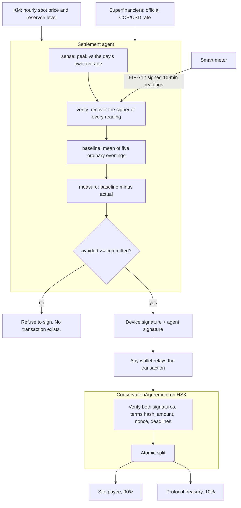

# MINGA Grid — Architecture

## 1. The flow



The contract name is inherited from the project this pivoted from; renaming it would mean
redeploying and re-verifying, which buys nothing. What it does is described below.

## 2. Sources of truth

| Thing | Authority |
|---|---|
| Programme terms, budget, payees, split | HSK Chain — `termsHash` binds all of them and they are immutable |
| Custody of the budget | the agreement contract; nothing else can move it |
| Whether a milestone is payable | two EIP-712 signatures verified on chain by `SignatureChecker` |
| What the meter measured | the device's signature over each reading |
| The counterfactual | the baseline method named in the programme terms — a convention, not a measurement |
| Grid conditions | XM's published data, with the day it belongs to carried alongside it |

## 3. Trust boundaries

1. **Nothing off chain can move money.** The agent produces one of the two required signatures. It
   cannot change the amount — `release()` pays the fixed milestone amount to immutable payees or
   reverts — and it cannot pay anyone else.
2. **The relayer is not an authoriser.** Whoever broadcasts the transaction pays gas. Their
   signature is not part of what the contract checks.
3. **A signature is non-repudiation, not physical truth.** It proves this device said this. It does
   not prove the meter was not tampered with. See `limitations.md`.
4. **The dispatch decision is arithmetic.** A model may propose what to research; whether money
   moves is decided by thresholds in code.
5. **Paid research is advisory.** External corroboration can inform whether an event is called. It
   can never turn a failed verification into an approval.

## 4. Components

```
apps/frontend      Next.js 14. The landing page, the app, and four route handlers that are the
                   entire backend for this flow: no database, no indexer, no funded key. This is
                   why the demo deploys as a single Vercel project.
apps/backend       Fastify + SQLite. SIWE, evidence storage, an HSK event indexer, a bounded MPP
                   research client. Used locally and by the inherited flow.
packages/contracts Solidity (Hardhat, OpenZeppelin). Escrow, dual-signature release, immutable
                   payees and splits, timeout refunds, reentrancy guards.
packages/shared    The agent, the meter simulator, the XM feed, EIP-712 schemas, canonical JSON
                   and ABIs. One implementation, consumed by all of the above and by the tests.
```

### Route handlers

| Route | What it does |
|---|---|
| `GET /api/grid/signal` | XM price and reservoir level, plus the agent's dispatch verdict and the thresholds it applied |
| `GET /api/grid/program` | On-chain budget, escrow, split and the receipt for each settled window |
| `GET /api/grid/site` | The baseline curve, both event scenarios, and what has been paid |
| `POST /api/grid/settle` | Runs one settlement pass and returns the arguments for `release()` — it never broadcasts and holds no key with funds |

## 5. The HSK RPC lags, and the code assumes it

`https://testnet.hsk.xyz` is load balanced across nodes that drift several seconds apart. A
transaction can be mined and its receipt confirmed while the very next read still returns the old
state. This broke three separate steps during development: a freshly created contract reading as
having no code, `fund()` reverting for an allowance that was already on chain, and a settlement
reporting a zero payout that had in fact landed.

Every script and route therefore waits for a read to confirm a write before depending on it
(`waitForCode`, `waitUntil`, `retry`). Anything new that touches HSK must do the same.

## 6. Verification

Contracts: 56 Hardhat tests. Backend and agent: 125 tests, the integration ones running against the
real contracts on a local anvil chain rather than mocks — including a real `release()` executed with
signatures the agent produced, and a check that a single machine signature cannot move funds.

Not covered: no external audit, no Slither or Mythril run, and no live payment to the Parallel MPP
gateway (that needs a funded operating account).
